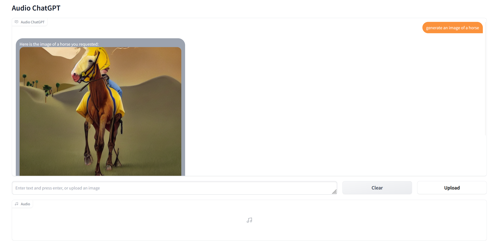
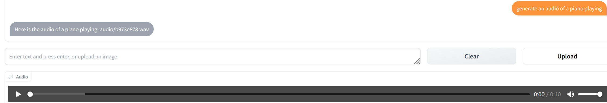

# Prompt Example
## Text-To-Image
Input Example : Generate an image of a horse 
Output: 
 
## Text-To-Audio
Input Example : Generate an audio of a piano playing 
Output: 
 
## Text-To-Sing
Input example : please generate a piece of singing voice. Text sequence is 小酒窝长睫毛AP是你最美的记号. Note sequence is C#4/Db4 | F#4/Gb4 | G#4/Ab4 | A#4/Bb4 F#4/Gb4 | F#4/Gb4 C#4/Db4 | C#4/Db4 | rest | C#4/Db4 | A#4/Bb4 | G#4/Ab4 | A#4/Bb4 | G#4/Ab4 | F4 | C#4/Db4. Note duration sequence is 0.407140 | 0.376190 | 0.242180 | 0.509550 0.183420 | 0.315400 0.235020 | 0.361660 | 0.223070 | 0.377270 | 0.340550 | 0.299620 | 0.344510 | 0.283770 | 0.323390 | 0.360340. 
Output: 
 
## Image-To-Audio
First upload your image(.png) 
Input Example : Generate the audio of this image 
Output: 
 
## ASR
First uploag your audio(.wav) 
Input Example : Generate the text of this audio 
Output: 
 
