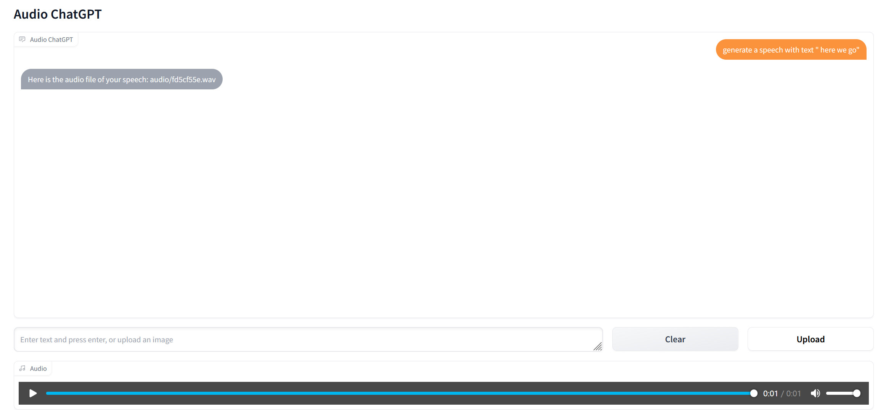
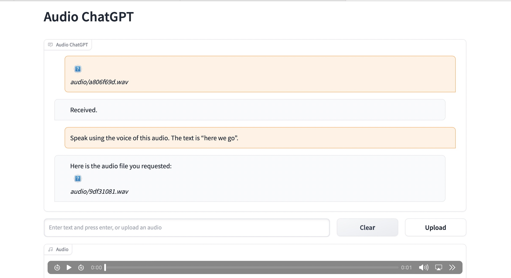
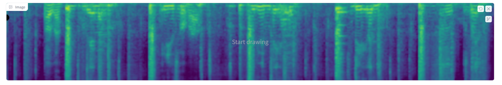
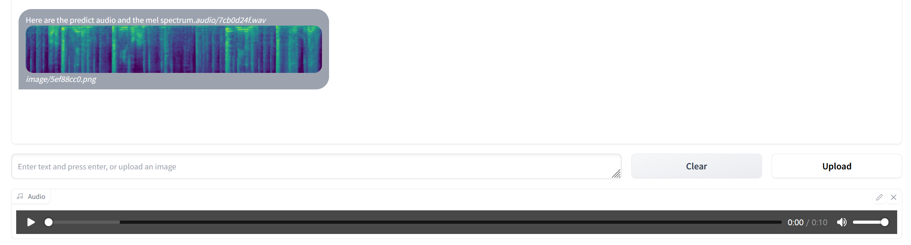
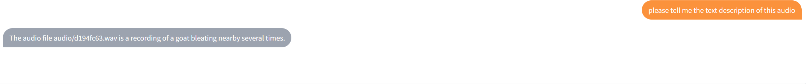
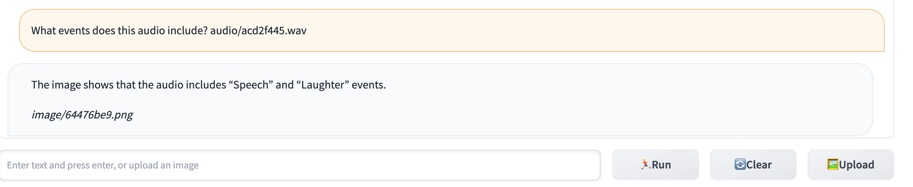
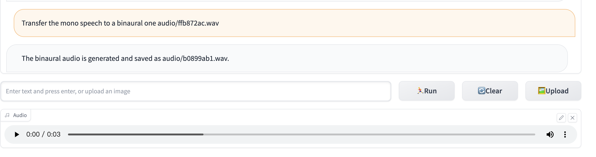
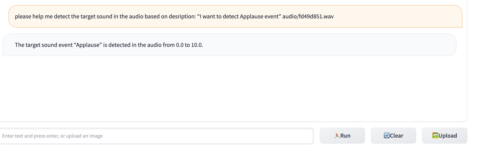
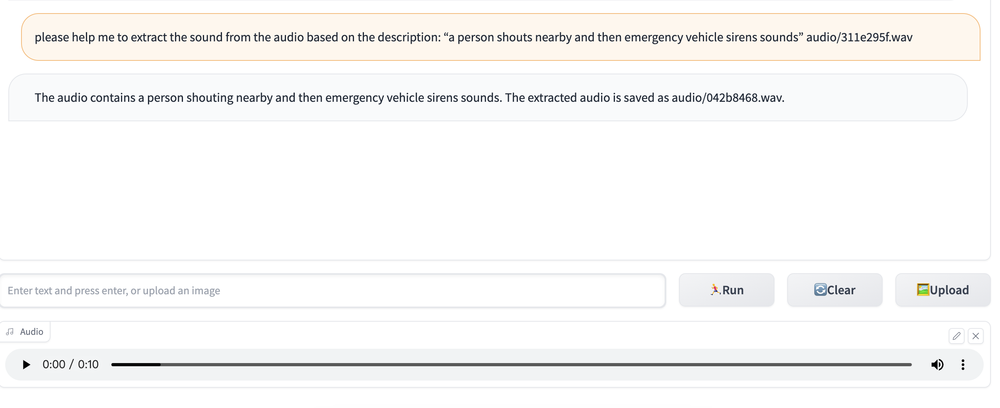

# Prompt Example
## Speech
### Text-To-Speech
Input Example : Generate a speech with text "here we go" 
Output: 
 
Audio: 
<audio src="fd5cf55e.wav" controls></audio> 

### Style Transfer Text-To-Speech
First upload your audio(.wav) 
Input Example : Speak using the voice of this audio. The text is "here we go". 
Output: 
 

### Speech Recognition
First upload your audio(.wav) 
Audio Example : 
<audio src="Track 4.wav" controls></audio> 
Input Example : Generate the text of this speech 
Output: 
 

## Sing
### Text-To-Sing
Input example : please generate a piece of singing voice. Text sequence is 小酒窝长睫毛AP是你最美的记号. Note sequence is C#4/Db4 | F#4/Gb4 | G#4/Ab4 | A#4/Bb4 F#4/Gb4 | F#4/Gb4 C#4/Db4 | C#4/Db4 | rest | C#4/Db4 | A#4/Bb4 | G#4/Ab4 | A#4/Bb4 | G#4/Ab4 | F4 | C#4/Db4. Note duration sequence is 0.407140 | 0.376190 | 0.242180 | 0.509550 0.183420 | 0.315400 0.235020 | 0.361660 | 0.223070 | 0.377270 | 0.340550 | 0.299620 | 0.344510 | 0.283770 | 0.323390 | 0.360340. 
Output: 
 
Audio: 
<audio src="2bf90e35.wav" controls></audio> 

## Audio
### Text-To-Audio
Input Example : Generate an audio of a piano playing 
Output: 
 
Audio: 
<audio src="b973e878.wav" controls></audio> 

### Audio Inpainting
First upload your audio(.wav) 
Audio Example : 
<audio src="drums-and-music-playing-with-a-man-speaking.wav" controls></audio> 
Input Example : I want to inpaint this audio. 
Output: 
 
Then you can press the "Predict Masked Place" button 
Output: 
 
Output Audio: 
<audio src="7cb0d24f.wav" controls></audio> 

### Image-To-Audio
First upload your image(.png) 
Input Example : Generate the audio of this image 
Output: 
 
Audio: 
<audio src="5d67d1b9.wav" controls></audio> 

### Audio-To-Text
First upload your audio(.wav) 
Audio Example : 
<audio src="a-group-of-sheep-are-baaing.wav" controls></audio> 
Input Example : Please tell me the text description of this audio. 
Output: 
 

### Sound Detection
First upload your audio(.wav) 
Audio Example : 
<audio src="mix.wav" controls></audio> 
Input Example : What events does this audio include? 
Output: 
 

### Mono audio to Binaural Audio
First upload your audio(.wav) 
<audio src="mix.wav" controls></audio> 
Input Example: Transfer the mono speech to a binaural one audio. 
Output: 
 

### Target Sound Detection
Fisrt upload your audio(.wav) 
<audio src="mix.wav" controls></audio> 
Input Example: please help me detect the target sound in the audio based on desription: “I want to detect Applause event” 
Output: 
 

### Sound Extraction
First upload your audio(.wav) 
<audio src="mix.wav" controls></audio> 
Input Example: Please help me extract the sound events from the audio based on the description: "a person shouts nearby and then emergency vehicle sirens sounds" 
Output: 
 
